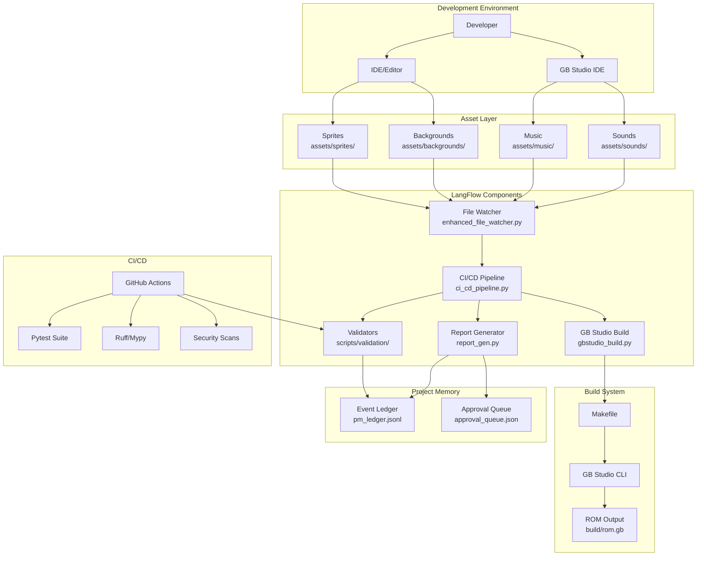
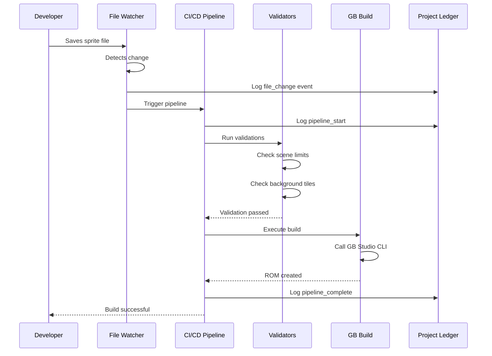
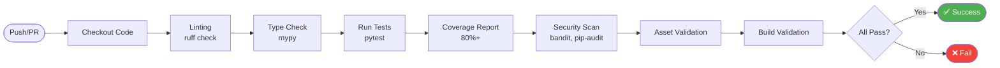
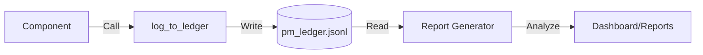
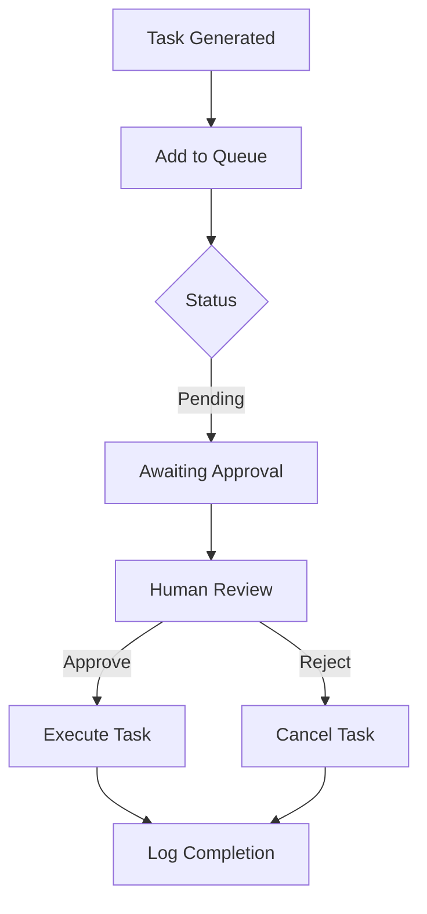

# Barry Sharp Pro Mover - Architecture Documentation

**Version:** 0.1.0
**Last Updated:** 2025-11-21
**Status:** Phase 3 (Advanced Features)

---

## Table of Contents

1. [System Overview](#system-overview)
2. [Architecture Diagram](#architecture-diagram)
3. [Component Architecture](#component-architecture)
4. [Directory Structure](#directory-structure)
5. [Data Flow](#data-flow)
6. [Integration Points](#integration-points)
7. [Build Pipeline](#build-pipeline)
8. [Testing Architecture](#testing-architecture)
9. [Deployment Architecture](#deployment-architecture)

---

## System Overview

Barry Sharp Pro Mover is a Game Boy Color action RPG developed using GB Studio 4.0+, enhanced with an AI-powered development workflow using LangFlow custom components.

### Technology Stack

| Layer | Technology | Purpose |
|-------|-----------|---------|
| **Game Engine** | GB Studio 4.0+ | Game Boy ROM compilation |
| **Workflow Engine** | LangFlow 1.4.x | AI-powered automation |
| **Backend** | Python 3.9+ | Custom components, validation |
| **CI/CD** | GitHub Actions | Automated testing, building |
| **Asset Pipeline** | Custom scripts | Validation, optimization |
| **Project Management** | JSONL ledger | Event tracking, approval queue |

### Key Design Principles

1. **Separation of Concerns**: Game assets, build logic, and AI workflow components are isolated
2. **Automation-First**: Manual tasks are automated wherever possible
3. **Quality Gates**: Multi-stage validation before builds
4. **Auditability**: All actions logged to project ledger
5. **Cross-Platform**: Works on macOS, Linux, Windows (via WSL)

---

## Architecture Diagram

### High-Level System Architecture



### Component Interaction Flow



### CI/CD Pipeline Flow



---

## Component Architecture

### LangFlow Custom Components

All custom components inherit from `langflow.components.base.custom.CustomComponent` and follow a consistent pattern:

```python
class ComponentName(CustomComponent):
    """Component description."""

    display_name = "Display Name"
    description = "Short description"

    def __init__(self):
        super().__init__()
        # Initialize paths, state

    def build(self, param1: str, param2: bool = True, **_) -> str:
        """Main execution method."""
        # Component logic
        return "Result string"
```

#### Component Catalog

| Component | File | Purpose | Dependencies |
|-----------|------|---------|--------------|
| **GB Studio Build** | `gbstudio_build.py` | Compile GB ROM from project | GB Studio CLI |
| **File Watcher** | `file_watcher.py` | Monitor files for changes | - |
| **Enhanced File Watcher** | `enhanced_file_watcher.py` | Advanced monitoring + auto-trigger | CI/CD Pipeline |
| **CI/CD Pipeline** | `ci_cd_pipeline.py` | Automated build/test/deploy | Validators, Build |
| **Report Generator** | `report_gen.py` | Generate status reports | Project ledger |
| **Approval Queue** | `approval_queue.py` | Manage workflow approvals | - |

### Validation Scripts

Located in `scripts/validation/`, these standalone Python scripts validate GB Studio project constraints:

| Script | Purpose | Limits Checked |
|--------|---------|----------------|
| `check_scene_limits.py` | Validate scene complexity | Actors (20), Triggers (30), Sprite Tiles (25-64) |
| `check_bg_tiles.py` | Validate background tiles | Unique tiles per background (192) |
| `check_json_schema.py` | Validate JSON structure | GB Studio schema compliance |

### Shared Utilities

Located in `.langflow/utils/`:

| Utility | Purpose | Functions |
|---------|---------|-----------|
| `logging.py` | Centralized event logging | `log_to_ledger()`, `load_ledger()`, `get_recent_events()` |

---

## Directory Structure

```
BarrySharpProMover/
├── .github/
│   └── workflows/              # GitHub Actions CI/CD
│       ├── ci.yml              # Testing, linting, security
│       ├── build.yml           # ROM build validation
│       └── dependency-review.yml
├── .langflow/
│   ├── components/             # LangFlow custom components
│   │   ├── gbstudio_build.py
│   │   ├── file_watcher.py
│   │   ├── enhanced_file_watcher.py
│   │   ├── ci_cd_pipeline.py
│   │   ├── report_gen.py
│   │   └── approval_queue.py
│   └── utils/                  # Shared utilities
│       ├── __init__.py
│       └── logging.py
├── assets/
│   ├── sprites/                # Game sprites (PNG)
│   ├── backgrounds/            # Background tiles (PNG)
│   ├── music/                  # Music files (MOD, UGE)
│   └── sounds/                 # Sound effects (WAV, VGM)
├── build/                      # Build outputs (gitignored)
│   └── rom.gb
├── docs/                       # Documentation
│   ├── ARCHITECTURE.md         # This file
│   ├── API.md                  # API documentation
│   └── INSTALLATION.md         # Setup guide
├── memory/                     # Project state (gitignored)
│   ├── pm_ledger.jsonl         # Event log
│   └── approval_queue.json     # Pending approvals
├── scripts/
│   ├── validation/             # Validation scripts
│   │   ├── check_scene_limits.py
│   │   ├── check_bg_tiles.py
│   │   └── check_json_schema.py
│   └── notify_cli.sh           # Notification helper
├── tests/
│   ├── conftest.py             # Pytest fixtures
│   ├── unit/
│   │   ├── test_gbstudio_build.py
│   │   └── test_validation.py
│   └── integration/
├── BARRY-SHARP-PRO-MOVER-1.gbsproj  # GB Studio project file
├── Makefile                    # Build automation
├── pyproject.toml              # Python package config
├── README.md                   # Project overview
├── CHANGELOG.md                # Version history
├── CONTRIBUTING.md             # Contribution guide
├── SECURITY.md                 # Security policy
├── REMEDIATION_PLAN.md         # Project roadmap
└── PHASE_*_SUMMARY.md          # Phase completion summaries
```

---

## Data Flow

### Event Logging Flow



**Event Log Entry Format:**
```json
{
  "timestamp": "2025-11-21T10:30:45.123456",
  "event": "build_complete",
  "agent": "ci_cd_pipeline",
  "task_id": "pipeline_1732186245",
  "details": {
    "status": "success",
    "rom_size": 524288,
    "duration": "45.2s"
  }
}
```

### Approval Queue Flow



**Approval Queue Entry Format:**
```json
{
  "task_id": "file_change_1732186245",
  "agent": "enhanced_file_watcher",
  "task_type": "file_change_detection",
  "description": "Detected 3 file changes",
  "details": {
    "asset_changes": ["sprites/player.png"],
    "total_changes": 3
  },
  "status": "detected",
  "submitted_at": "2025-11-21T10:30:45.123456",
  "comments": ""
}
```

---

## Integration Points

### GB Studio Integration

**Method:** GB Studio CLI (command-line interface)

**Location Detection:**
1. `gbstudio-cli` in PATH
2. `/Applications/GB Studio.app/Contents/Resources/app.asar.unpacked/out/cli/gb-studio-cli.js` (macOS)
3. `$HOME/gb-studio/out/cli/gb-studio-cli.js` (custom build)

**Build Command:**
```bash
node /path/to/gb-studio-cli.js build \
  --project /path/to/project.gbsproj \
  --buildType rom \
  --output /path/to/output
```

### LangFlow Integration

**Component Registration:**
Components are auto-discovered by LangFlow when placed in `.langflow/components/`.

**Execution Context:**
- Components run in LangFlow's FastAPI backend
- Each component is a node in a visual flow
- Outputs can be chained to other components

**Communication:**
```python
# Component A output
result = "Build complete: rom.gb"
return result

# Component B receives as input
def build(self, previous_output: str):
    print(f"Received: {previous_output}")
```

### GitHub Actions Integration

**Trigger Events:**
- Push to `main` or `claude/**` branches
- Pull requests to `main`
- Manual workflow dispatch

**Environment Setup:**
```yaml
- uses: actions/checkout@v4
  with:
    lfs: true
- uses: actions/setup-python@v5
  with:
    python-version: '3.11'
- run: pip install -e ".[dev]"
```

---

## Build Pipeline

### Local Build (Make)

```bash
# Full build with all checks
make build-and-test

# Individual steps
make check-bg          # Validate backgrounds
make check-scenes      # Validate scenes
make check-json        # Validate JSON
make build-rom         # Build ROM
make run-emulator      # Launch in emulator
```

### CI/CD Build (GitHub Actions)

**Workflow:** `.github/workflows/build.yml`

**Steps:**
1. Checkout with LFS
2. Setup Node.js 18
3. Validate Makefile syntax
4. Verify project structure
5. Run validation scripts
6. Create build artifact

**Artifacts:**
- Build validation report (7 day retention)
- Coverage reports (uploaded to Codecov)

---

## Testing Architecture

### Test Organization

```
tests/
├── conftest.py              # Shared fixtures
├── unit/
│   ├── test_gbstudio_build.py    # 20 tests
│   └── test_validation.py         # 10+ tests
└── integration/
    └── (future integration tests)
```

### Shared Fixtures (conftest.py)

| Fixture | Purpose | Scope |
|---------|---------|-------|
| `temp_project_dir` | Isolated test directory | Function |
| `mock_subprocess` | Mock CLI execution | Function |
| `sample_gbsproj_path` | Sample project file | Function |
| `mock_langflow_component` | Mock LangFlow base | Function |
| `sample_approval_queue` | Test approval data | Function |
| `sample_ledger_entries` | Test event log | Function |

### Test Execution

```bash
# Run all tests with coverage
pytest --cov=.langflow --cov-report=html

# Run specific test file
pytest tests/unit/test_gbstudio_build.py -v

# Run tests matching pattern
pytest -k "test_successful" -v
```

### Coverage Requirements

- **Minimum:** 80% overall coverage
- **Target:** 85%+ per module
- **Exclusions:** `__init__.py`, standalone scripts

---

## Deployment Architecture

### Local Deployment

**Target:** Development machine

**Process:**
1. ROM built to `build/rom.gb`
2. Playable in emulator (BGB, SameBoy, etc.)
3. Flashable to physical cartridge

### Staging Deployment

**Target:** `staging/` directory

**Process:**
1. ROM copied with timestamp: `barry_sharp_20251121_103045.gb`
2. Manual testing and validation
3. Approval for production

### Production Deployment

**Target:** itch.io / GitHub Releases (future)

**Process:**
1. Create GitHub release with ROM
2. Upload to itch.io
3. Notify stakeholders

---

## Security Considerations

### Input Validation

- **File paths:** Validated to prevent directory traversal
- **Subprocess commands:** No user-controlled command execution
- **JSON parsing:** Protected against malformed input

### Secrets Management

- **No secrets in repo:** `.env` files gitignored
- **GitHub tokens:** Stored in GitHub Secrets
- **API keys:** Environment variables only

### Dependency Security

- **Automated scanning:** `pip-audit` and `dependency-review-action`
- **Update policy:** Patch within 7 days for high/critical
- **Locked dependencies:** `requirements.txt` with hashes (future)

---

## Performance Considerations

### Build Performance

| Operation | Typical Time | Optimization |
|-----------|--------------|--------------|
| ROM build | 10-30s | Asset caching |
| Validation | 1-3s | Parallel execution |
| Test suite | 5-10s | Pytest-xdist (future) |
| CI/CD pipeline | 5-6 min | Matrix parallelization |

### Asset Optimization

- **Sprites:** PNG optimization before build
- **Backgrounds:** Tile deduplication
- **Music:** UGE compression
- **Sounds:** VGM optimization

---

## Extensibility

### Adding New Components

1. Create file in `.langflow/components/`
2. Inherit from `CustomComponent`
3. Implement `build()` method
4. Add tests in `tests/unit/`
5. Document in `docs/API.md`

### Adding New Validators

1. Create script in `scripts/validation/`
2. Follow pattern: read JSON, check constraints, report errors
3. Add to `Makefile` validation targets
4. Add to CI/CD workflow
5. Add tests

### Adding New Workflows

1. Create YAML in `.github/workflows/`
2. Define triggers and jobs
3. Test with `act` (local GitHub Actions simulator)
4. Document in this file

---

## Future Architecture

### Phase 3 Enhancements (In Progress)

- ✅ Shared logging utilities
- 🚧 Comprehensive documentation
- ⏳ AI-powered design assistant
- ⏳ Asset validator with embeddings

### Phase 4 Roadmap (Security & Performance)

- Code signing for releases
- Performance profiling tools
- Advanced caching strategies
- Multi-language support for documentation

---

## Glossary

| Term | Definition |
|------|------------|
| **GB Studio** | Visual game development tool for Game Boy |
| **LangFlow** | AI workflow automation platform |
| **JSONL** | JSON Lines format (one JSON object per line) |
| **ROM** | Read-Only Memory; compiled game file |
| **Ledger** | Event log tracking all project actions |
| **Approval Queue** | Queue of tasks awaiting human approval |
| **Component** | LangFlow custom node with specific functionality |

---

## References

- [GB Studio Documentation](https://www.gbstudio.dev/docs/)
- [LangFlow Documentation](https://docs.langflow.org/)
- [GitHub Actions Documentation](https://docs.github.com/en/actions)
- [Project Remediation Plan](../REMEDIATION_PLAN.md)

---

*Last Updated: 2025-11-21*
*Maintained by: Barry Sharp Pro Mover Development Team*
